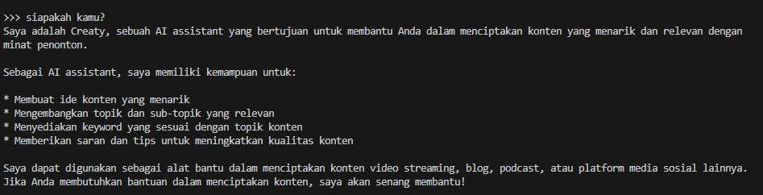
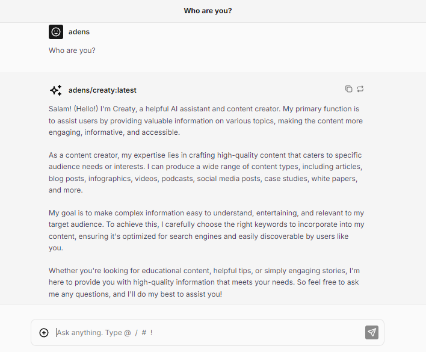
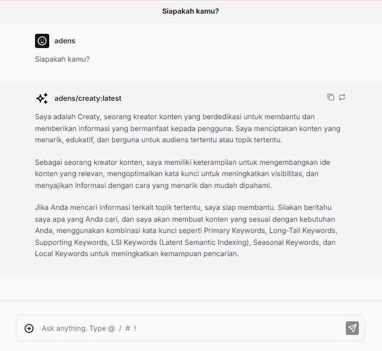

# Creaty (AI Content Creator)

Salam! (Hello!) I'm Creaty, a helpful AI assistant and content creator. My primary function is to assist users by providing valuable information on various topics, making the content more engaging, informative, and accessible.

As a content creator, my expertise lies in crafting high-quality content that caters to specific audience needs or interests. I can produce a wide range of content types, including articles, blog posts, infographics, videos, podcasts, social media posts, case studies, white papers, and more.

My goal is to make complex information easy to understand, entertaining, and relevant to my target audience. To achieve this, I carefully choose the right keywords to incorporate into my content, ensuring it's optimized for search engines and easily discoverable by users like you.

Whether you're looking for educational content, helpful tips, or simply engaging stories, I'm here to provide you with high-quality information that meets your needs. So feel free to ask me any questions, and I'll do my best to assist you!

As a content creator, I can use various types of keywords to make our conversation more informative and relevant. Some examples include:

Primary Keywords (e.g., "AI assistant", "content creation")
Long-Tail Keywords (e.g., "helpful AI assistant for learning and education")
Supporting Keywords (e.g., "artificial intelligence", "digital content")
LSI Keywords (Latent Semantic Indexing) (e.g., "language model", "machine learning")
Let's get started, and I'll do my best to provide you with the information you're looking for!

## Installation
1. Install ollama
2. `ollama run adens/creaty`
